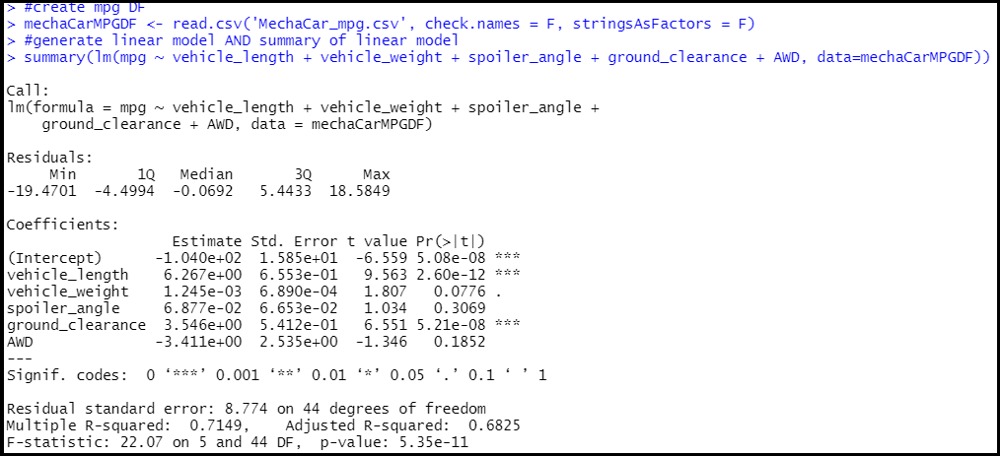
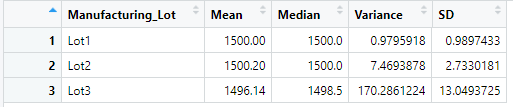
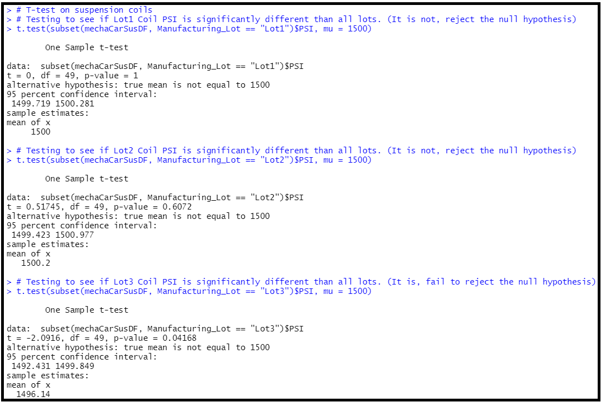

# MechaCar_Statistical_Analysis

## Linear Regression to Predict MPG
- As shown in the screenshot below, vehicle length and ground clearance provided a non-random amount of variance to mpg in the dataset.
- The slope of the linear model is non-zero due to the coefficients for the vehicle length and ground clearance. The other coefficients are near-zero and do not contribute significantly.
- The linear model has an adjusted R-squared value of 0.68. A model is considered strong when the R-squared is greater than 0.7, therefore this model is not considered a strong predictor of mpg.

## Summary Statistics on Suspension Coils
- The design specification for the suspension dictates that the coil variance should not exceed 100 psi.
- If all lots are combined, the total variance is 62 psi which is passing per the spec.
- When the lots are individually analyzed, lot 3 appears to have a manufacturing defect because it's variance is 170 psi which does not pass the spec.
 

## T-Tests on Suspension Coils
- Lots 1 and 2 have means that are not statistically different from the population mean of 1500 psi.
- This is confirmed through their p-values that are >0.05.
- Lot 3 on the other hand is p<0.05 and therefore has a statistically different mean than the population.

